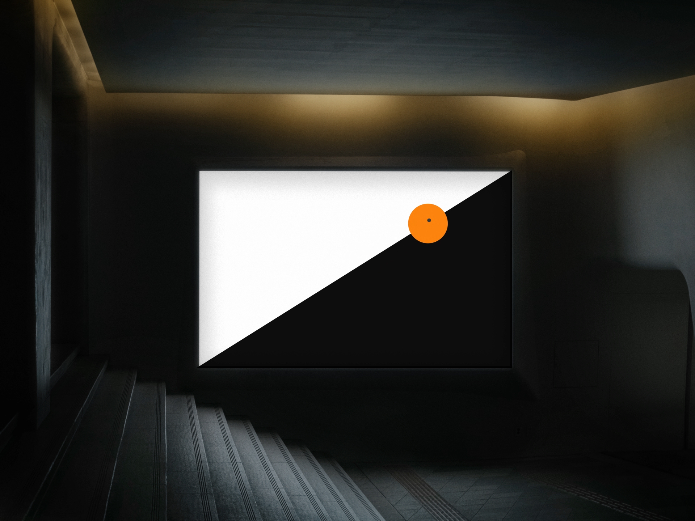
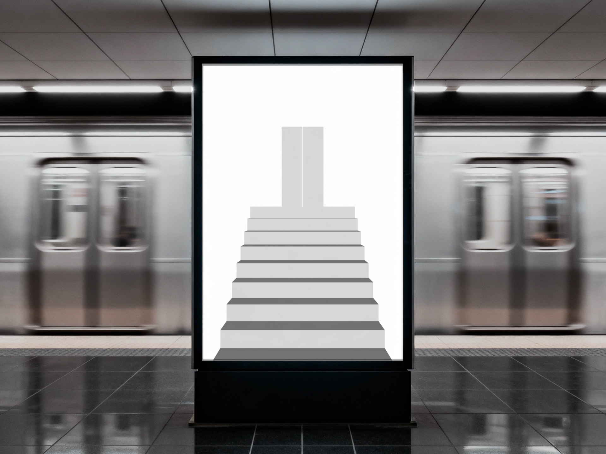
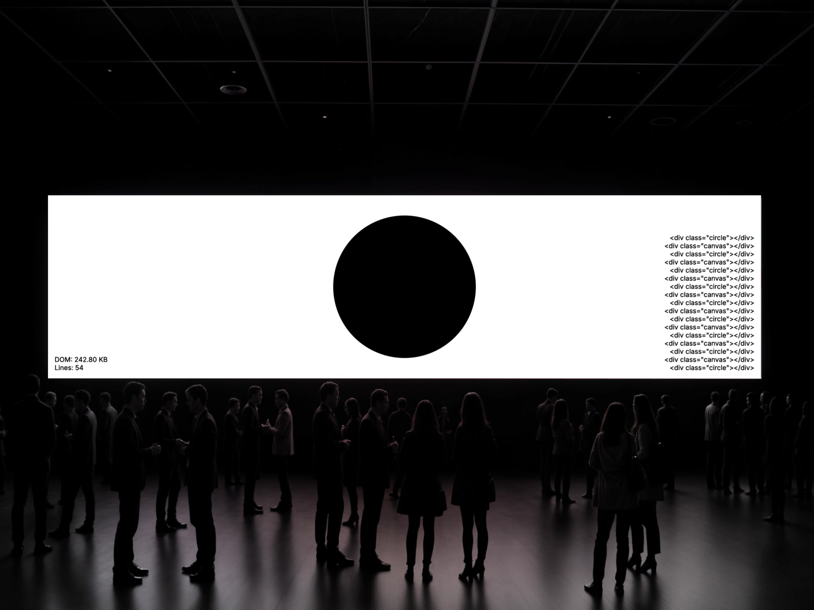
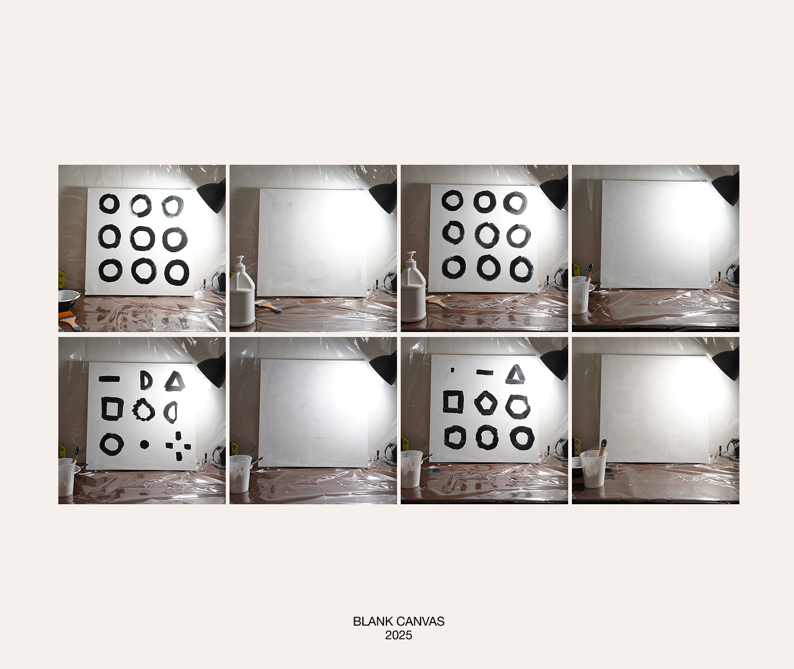
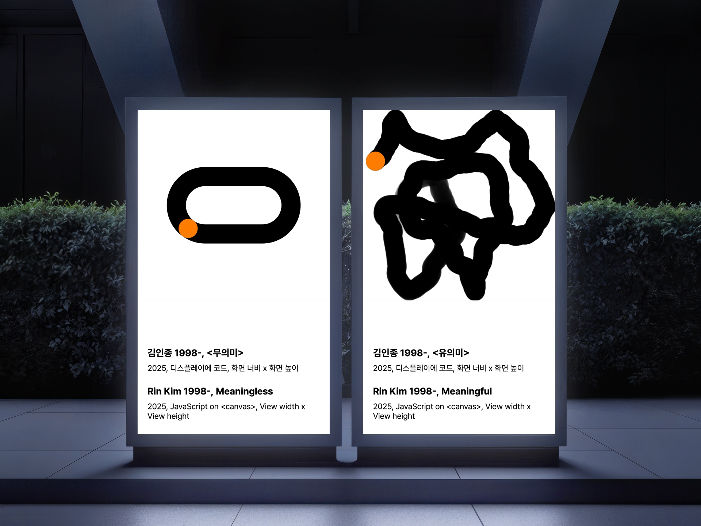

# Loops

## Concept and Context

This project is an interactive artwork that reveals the tension between involuntary loops[^1] that we are placed in and the chosen thresholds[^2], actions that we choose to take. The form of the work is a multi-screen installation composed of mini touch displays, each presenting unique interactive artwork. Alongside touch interactions, each display has a camera that enables motion-capture interactions, transforming viewer’s gestures into a subtle part of the experience. By situating multiple loops side by side, the piece underscores the paradox of repetition: while endless cycles may feel absurd, they can also hold meaning and possibility when reframed.

[^1]: Continuous cycle of activities and circumstances that we were compelled to engage in or adhere to.

[^2]: Autonomy to determine our actions and interpretations.

This project was born from a period of personal reflection following an intense phase of creative work. I felt caught in daily repetitions that seemed meaningless. Over time, I began to see these loops differently, I embraced them. It reminded me again of my personal motto: live like water. Water adapts to its environment, sometimes soft and yielding, sometimes forceful and unyielding. It follows the paths carved before it, yet over time it reshapes stone, carving out new directions. In the same way, I move through the loops of life that are given to me, but at every threshold I choose how to adapt, when to resist, and when to transform. This metaphor drives my motivation and also frames my goal for the audience. By experiencing these digital loops, viewers are invited to reflect on their own patterns and consider how subtle thresholds might open up new interpretations of their routines. Rather than resisting repetition, the work encourages acceptance, play, and the regaining of agency.

Within the context of interactive art, this project distinguishes itself because it positions interactivity not only as a physical engagement but also as a way to critically examine one's thoughts on repetition and absurdity. When viewers mentally engage with the artwork, I hope the they will take a moment to interpret and respond. The work suggests that rather than resisting these loops, we can accept their presence, embrace their absurdity, and ultimately regain a sense of agency.

## References and Research

Albert Camus's philosophical essay "The Myth of Sisyphus" was my primary inspiration, as it examines the absurdity of endless repetition while suggesting that meaning can still exist within it. This text helped me recognize the absurdity in my own life, opening a path toward reclaiming my sense of agency. Precedents in fine art such as the works by Seo-bo Park, Nam June Paik, and Hyunki Park helped me understand how repetition and absurdity have been explored in art form. Digital contemporary artworks by Rafaël Rozendaal and Zach Lieberman helped me imagine code as a medium to depict interactive loops.

Two primary research were conducted to narrow down the scope of the concept.

First was a drawing elicitation workshop where testers were asked to visualize abstract concepts as patterns. This research examined whether similar patterns would emerge in the sketches of the participants, and explored different forms of visualizing the given concept. Participants were presented with four words, _absurdity_, _meaningful_, _error_, and _success_, along with their dictionary definitions. They were then asked to intuitively draw patterns that came to mind.

The results -

The second research was diary study where subjects were asked to log what they’ve noticed themselves repeating unconsciously. They were asked to record at least 3 events per day for a total of 3 days. They were given a prompt to record the date and time, the event, emotion that emerged from realizing the repetitive action, and their thoughts on it.

The results -

## #1 - Myth of Sisyphus

Albert Camus’ Myth of Sisyphus retells the story of the Greek titan condemned to push a boulder up a hill only to see it fall back again. In this endless, absurd task, Camus finds a metaphor for our search for meaning in an indifferent world. Yet he ends with a radical turn: “One must imagine Sisyphus happy.”

In that line, Sisyphus is no longer a victim of punishment but a figure of defiance, reclaiming agency through acceptance. He embraces his circumstance and his struggle becomes his purpose; the act of rolling the rock becomes an act of choice.

_Myth of Sisyphus_, the first piece in the Loop series, is a digital interpretation of Albert Camus’ philosophical essay on the absurd and the human pursuit of meaning. The work transforms Sisyphus’ endless labor into an interactive, meditative loop.

The orange circle on the screen represents the boulder. Viewers can grasp and drag it either with a mouse or by using their hand through real-time webcam motion tracking. As they push the digital rock toward the top of the screen, it inevitably rolls back down in either direction, inviting continuous repetition.

The loop has no reward, no score, and no ending. Through this repetition, the audience becomes both observer and participant in the myth.

### Interaction

The piece offers two modes of control:

- **Mouse input** 
  The user clicks and drags the orange circle (the rock) up the black triangular slope.

- **Hand-tracking camera input** 
  Using a webcam, the system detects user’s hand and replaces the cursor with a small circle that follows their motion.

### Technical Overview

The sketch is built on JavaScript, p5.js for visual rendering and ml5.js for hand tracking through camera feed.

- **Hand tracking** 
  Uses `ml5.handPose()` with a single-hand model (maxHands: 1, flipped: true). The function gotHands receives pose results and computes the average position of 6 keypoints (wrist and finger bases) to estimate hand center.

- **Motion smoothing** 
  Hand coordinates are filtered with a lerp-based smoothing factor `handSmoothingFactor = 0.2` to prevent jitter and create fluid motion.

- **Spatial bounds** 
  The hand position is constrained with screen insets (`handBoundsInsetX/Y = 0.08`, meaning 8% of the windowWidth/Height) to maintain consistent control regardless of camera framing.

- **Physics simulation** 
  Gravity (0.5) acts on the rock’s velocity. The hill geometry flips direction at the end of each iteration, forming an endless repetition. The rock’s position updates along the slope equation to simulate rolling motion.

### Reflections

This project lays foundations to this entire collection. It was born from the monotony and mundaneness of everyday repetition, and in making it, I found myself repeating again, trapped in the same cycle I was trying to express. The process mirrored the work’s concept: building, testing, watching the rock fall, and starting over.

The moment when the rock slides back to the bottom isn’t a failure, it’s a renewal. Each reset is another chance to start, another loop to inhabit. Through this, I began to see the core of my project that repetition, when accepted and embraced, can become a quiet space for reflection, patience, and persistence.

In testing, people inhabited this loop in noticeably different ways. One participant tried hard to reach the peak, failed several times, finally succeeded, watched the rock fall, and immediately walked away. Another kept going, pushing the rock again and again as a small challenge. A third held the rock still in the middle of the slope and said that was where they wanted it to stay.

These responses clarified what the piece is really asking. The system defines the hill, gravity, and the inevitability of return—but agency shows up in how someone chooses to stay with the repetition, resist it, pause it, or leave. “Winning” doesn’t resolve the loop; it only reveals it. The work becomes less about reaching the top and more about noticing what it feels like to keep choosing to push.

## #2 - Doors

A door is one of the most ordinary things we encounter, yet it quietly defines how we move through the world. Every time we pass through one, we shift roles and identities. Stepping through the office door, we become our work-self, returning home, we become our private self. Each doorway marks a subtle transformation, A threshold between who we were and who we are about to be.

_Doors_ extends this everyday ritual into an infinite sequence. The piece visualizes transition as an endless corridor of alternating black and white thresholds. Each passage mirrors the phases of life - child to adult, student to professional, beginnings and endings - where every role reshapes our sense of self. The alternating colors represent the dualities that frame existence: light and dark, life and death, presence and absence.

Walking through these doors becomes a metaphor for continual transformation. The corridor never ends, it only loops. Each step forward collapses into the next, reminding us that every conclusion simply opens another beginning.

### Interaction

_Doors_ uses subtle body tracking to create a sense of presence within the corridor.

- **Body and face input** 
  The webcam tracks the viewer’s face and upper body using the `ml5.bodyPose()` model. As the viewer moves left or right, the orientation of the 3D door rotates to face the viewer, as if the world is responding to their movement.

- **Autonomous movement** 
  The environment itself advances through the space. The staircase and corridors move autonomously as if the viewer is climbing the stairs, walking along the corridor, and opening the door. The space fades after the door opens, leading to another scene of a corridor.

### Technical Overview

The sketch is built in JavaScript, using p5.js (WEBGL) for 3D rendering and ml5.js for upper body and face tracking.

- **Rendering and motion**
  The environment is constructed from box primitives forming stairs, walls, and a floor plane. The camera advances forward using interpolated offsets `currentOffset` and `targetOffset` for smooth motion.

- **Step sequencing**
  The motion progresses in timed increments `MOVE_INTERVAL`, `STEP_SIZE, SMOOTH_SPEED` for `MAX_MOVES` cycles before entering a final long transition `FINAL_MOVEMENT`, `FINAL DURATION`

- Scene inversion

- Face tracking

### Audio Source

An ambient soundtrack accompanies the piece, reinforcing the sense of forward motion and spatial depth. The repeating rhythm of the audio complements the continuous passage through doors, creating an immersive and meditative atmosphere.

Source: _Feel_ by Master Minded, [artlist.io](https://artlist.io/royalty-free-music/song/feel/132927).

[Feel_License.pdf](static/files/Feel_License.pdf)

### Reflections

Testing made it clear that _Doors_ invites projection. One visitor began moving their legs in place, trying to sync their steps with the advancing stairs. They assumed their lower-body movement was driving the scene, treating the loop as a coordinated journey. That misreading was revealing: it showed how quickly people invent a sense of control even when none is actually available.

Others sat still and waited for something more to happen, then expressed frustration at how slowly the corridor moved. A few reflected that they’ve become accustomed to fast-paced media and immediate feedback. These reactions turned the piece into a mirror for expectations about pace, progress, and control. A simple, slow loop was enough to surface those expectations and make them available as material for reflection.

## #3 - Accumulation

_Accumulation_ is a sketch about buildup that looks like nothing is happening.

It’s based on a painting exercise: repeatedly drawing a black circle, then covering it with white paint, until the canvas appears blank—while physically getting heavier from layered material.

This piece recreates that logic in the browser by stacking visual layers over time. Every second, it adds a new layer without removing anything: sometimes a centered circle, sometimes a full-screen “canvas” overlay. The surface may look minimal, but the system keeps accumulating underneath.

Visually, the work oscillates between presence and erasure. Technically, it is literal accumulation: the piece continuously adds elements to the page, and the interface reveals this hidden growth through counters that track how much has been added.

### Interaction

- **Click anywhere**
  - Flips the color scheme (white ↔ black).
  - Resizes the circle based on where the user clicks: the farther from the center, the larger the circle.

### Technical Overview

- **Timed layering**
  The work runs on a simple timer. It continuously adds new layers at fixed intervals, alternating between a centered circle and a full-screen overlay. The layers stack indefinitely and are never removed.

- **Accumulation made visible**
  The interface displays two indicators that reflect the ongoing buildup:

  - a rough estimate of page “weight” (DOM size)
  - a line counter / log that increases each time a new layer is added

- **Layered composition**
  The visuals are built from two repeating element types:
  - a centered circle whose size is controlled by a CSS variable
  - a full-screen overlay that covers the entire viewport

### Reflections

In observation, the interaction in _Accumulation_ was not immediately legible to most viewers. Without explanation, many treated it as a non-interactive animation and never discovered that clicking changes the structure. The idea of DOM growth as “digital weight” was also most visible to people already familiar with HTML and how documents are built.

But once the premise was explained—that every second adds new elements and “weight,” both visually and in code, many people said it resonated with their own sense of hidden build-up: routines, stress, habits, and quiet accumulation that doesn’t read as change until it’s named. That gap between initial perception (blank, minimal, nothing happening) and later understanding became part of the piece. It highlighted how some forms of repetition and accumulation stay invisible until there’s a threshold moment where they become recognized.

## #7 - Meaning

_Meaning_ is a two-part sketch built from a simple reversal.

It was developed from the drawing elicitation workshop, where participants repeatedly visualized **meaningfulness** as symmetry and structure, and **absurdity** as randomness and disorder. This piece takes that shared visual language and flips its labels: the structured sketch is titled **Meaningless(무의미)**, and the chaotic sketch is titled **Meaningful(유의미)**. By placing expectation and naming in conflict, the work asks how quickly meaning can be assigned, lost, or re-made.

In **Meaningless**, an orange dot (🟠) circles a stadium-like path. The motion reads as controlled and intentional, but the longer it continues, the more it can start to feel trapped—perfect structure without escape. In **Meaningful**, the orange dot drifts unpredictably across the canvas. It may look pointless at first, but over time it invites attention through curiosity: where will it go next, and what kind of pattern might appear only after watching for longer?

Together, the two canvases treat meaning as something that emerges through duration and interpretation rather than through form alone. The dot becomes a stand-in for the self moving through time, and the work asks which feels more “meaningful”: staying inside a stable system, or wandering without a clear path.

### Interaction

This prototype has no direct physical interaction. The threshold happens through reading and looking:

- The titles shape first impressions.
- Meaning emerges by comparing the two canvases and noticing how perception shifts over time.

### Technical Overview

- **Two-canvas structure**
  The work presents two sketches side by side to encourage comparison rather than progression.

- **Contrasting motion systems**
  One sketch constrains the dot to a looped path, while the other allows it to wander with non-repeating movement logic. The contrast is designed to feel “controlled” versus “uncontrolled,” even before the labels intervene.

- **Title reversal as the main mechanism**
  The simplest change—naming—acts like an interface. It redirects interpretation without changing the motion itself.

### Reflections

This piece clarified how much viewers want coherence. When the titles contradict the visuals, people rarely dismiss it—they start searching for an explanation, re-reading the motion until it “fits.” That interpretive effort becomes the loop.

It also set a direction for the larger project: the strongest part of the prototype is how quickly it produces reflection with minimal form. The open challenge is translating that same “label vs. perception” tension into a multi-screen installation where the body participates, not just the eyes.

## Meaning

The first prototype, available at [https://thesis.rin.kim/prototype-01/index.html](https://thesis.rin.kim/prototype-01/index.html), explores the findings from the drawing elicitation research. A pattern that emerged from participants’ drawing was the consistent depiction of absurdity as random scribbles and meaningfulness as symmetrical or structured sketches. To challenge this expectation, these patterns were digitalized with the titles reversed. The canvas resembling participants’ “_meaningful_” sketches was titled **Meaningless(무의미)**, while the one resembling “_absurd_” sketches was titled **Meaningful(유의미)**. By defamiliarizing and reversing common assumptions, the artwork triggers viewers to think “what really is meaningful?”

In the **Meaningless** canvas, a blue dot(🔵) circles a stadium shape. At first, this movement appears meaningful and controlled, but its endless repetition soon produces a sense of discomfort, as if trapped in an unbreakable loop. In the **Meaningful** canvas, the blue dot wanders randomly across the screen. Its unpredictable movement initially feels absurd, but over time it draws the viewer’s attention as they begin to wonder where it will go next. Together, the two pieces metaphorically connect the workshop sketches to life itself: the white canvas becomes a metaphor for life, the black lines symbolize the trails we leave behind, and the blue dot represents ourselves. The work questions which path carries more meaning, staying within a structured pattern or breaking free in to chaos.

This prototype was set up on a large TV in a room, framed like a gallery space. Viewers were asked to engage with it as they would in a gallery, by reading the descriptions and observing the canvases. Although the prototype had no physically interactive component, the presentation itself emphasized the tension between title, description, and the visual form.

The prototype demonstrates a few clear strengths. Its simplicity and abstractness makes the metaphor accessible, and the reversal of labels provokes reflection. The dual structure of canvases helps viewers compare their interpretations of meaningfulness and meaninglessness. However, the prototype also leaves important questions open. How can interaction move beyond passive observation to embody thresholds? How might the experience scale to multiple screens without losing its reflective quality? And what forms, beyond circles and wandering dots, might loops and thresholds take?

Feedback from this testing session was intriguing. -

## Technology Stack

- Frontend: SvelteKit
- Deployment: Vercel
- Canvas: p5.js or vanilla js
- Motion Sensing: ml5.js
